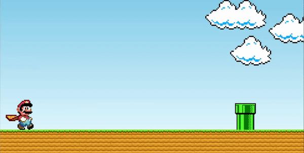

<p align="center">
  
</p>

<br>

## 💻 Projeto

Mario-Jump: um simples jogo do super mario, feito com html, css e javascript;

## 👨‍💻 Mentor

- [Aula Youtube](https://www.youtube.com/watch?v=r9buAwVBDhA)

## 🧑🏾‍💻 Iniciando o projeto


**Clone o projeto e acesse a pasta**

```bash
git clone https://github.com/vinive/super-mario-jump.git
```

**Siga os passos**

```bash
# Acesse a pasta do jogo
$ cd super-mario-jump

$ abra o arquivo index.html no browser

$ DIVIRTA-SE 😄
```


Desenvolvido por [Vinicius](https://github.com/vinive) 👻
